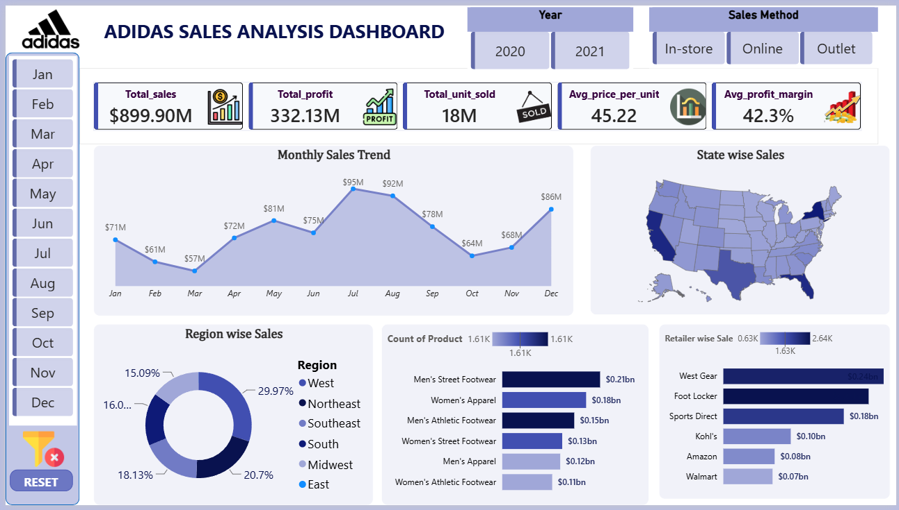

# Adidas Sales Analysis Dashboard – Power BI

## 📊 Project Overview

This project presents an interactive Adidas Sales Analysis Dashboard developed using Microsoft Power BI.

The dashboard analyzes Adidas sales performance across the United States for the years 2020 and 2021. It provides insights into sales trends, profitability, units sold, regional performance, state-wise sales, product categories, and retailer performance.

The goal of this project is to transform raw sales data into an interactive business intelligence dashboard that can help identify sales trends, high-performing products, profitable regions, and major retail channels.

---

## 🎯 Objectives

The main objectives of this project are:

- Analyze overall Adidas sales performance.
- Track monthly sales trends.
- Compare sales performance across different states.
- Analyze regional sales distribution.
- Identify top-performing product categories.
- Compare sales across different retailers.
- Analyze profit and profit margin.
- Understand the relationship between sales and units sold.
- Create an interactive dashboard for business decision-making.

---

## 🛠️ Tools & Technologies

- Microsoft Power BI
- Power Query
- DAX
- Microsoft Excel
- Data Visualization
- Data Cleaning
- Exploratory Data Analysis

---

## 📁 Dataset

The dataset contains Adidas sales information for the United States.

The dataset includes information related to:

- Sales
- Profit
- Units Sold
- Price per Unit
- Profit Margin
- Retailer
- Sales Method
- Product Category
- Region
- State
- Date

The analysis covers the years 2020 and 2021.

> Note: The original dataset should only be included in this repository if redistribution is permitted by its source/license.

---

## 📊 Dashboard Features

### KPI Cards

The dashboard provides the following key performance indicators:

- Total Sales
- Total Profit
- Total Units Sold
- Average Price per Unit
- Average Profit Margin

---

### 📈 Monthly Sales Trend

The monthly sales trend visual shows how Adidas sales changed throughout the year.

This helps identify:

- High-performing months
- Low-performing months
- Seasonal sales patterns
- Overall sales movement

---

### 🗺️ State-wise Sales

The map visual displays Adidas sales across different US states.

This helps identify:

- States with higher sales
- States with lower sales
- Geographic sales distribution

---

### 🌎 Region-wise Sales

The regional analysis compares sales across different regions.

The dashboard includes:

- West
- Northeast
- Southeast
- South
- Midwest
- East

A donut chart is used to visualize the contribution of each region to overall sales.

---

### 👟 Product Category Analysis

The dashboard compares sales across Adidas product categories, including:

- Men's Street Footwear
- Women's Apparel
- Men's Athletic Footwear
- Women's Street Footwear
- Men's Apparel
- Women's Athletic Footwear

This helps identify the product categories contributing the most to sales.

---

### 🏪 Retailer-wise Sales

The dashboard compares sales performance across major retailers, including:

- West Gear
- Foot Locker
- Sports Direct
- Kohl's
- Amazon
- Walmart

This helps identify the strongest retail channels.

---

### 🛒 Sales Method

The dashboard allows users to analyze different sales methods:

- In-store
- Online
- Outlet

This makes it possible to compare sales performance across different purchasing channels.

---

## 🎛️ Interactive Filters

The dashboard contains interactive filters that allow users to analyze the data dynamically.

### Year

- 2020
- 2021

### Sales Method

- In-store
- Online
- Outlet

### Month

- January
- February
- March
- April
- May
- June
- July
- August
- September
- October
- November
- December

Users can combine multiple filters to perform more detailed analysis.

---

## 📌 Key Insights

Some important insights from the dashboard include:

- Total sales are approximately $899.90M.
- Total profit is approximately $332.13M.
- Approximately 18M units were sold.
- Average price per unit is approximately 45.22.
- Average profit margin is approximately 42.3%.
- July recorded one of the highest monthly sales values.
- The West region contributes the largest share of regional sales.
- Men's Street Footwear is one of the strongest-performing product categories.
- West Gear is the highest-performing retailer among the retailers shown in the dashboard.

---

## 📷 Dashboard Preview



---

## 📂 Project Structure

```text
Adidas-Sales-Analysis-PowerBI/
│
├── Dashboard/
│   └── Adidas_Sales_Analysis.pbix
│
├── Dataset/
│   └── adidas_sales_data.xlsx
│
├── Images/
│   └── Adidas_Sales_Dashboard.png
│
└── README.md
